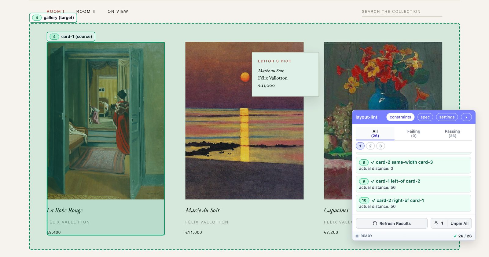

# layout-lint


**[Try it live →](https://cnobis.github.io/layout-lint/)**

A DSL for testing layout in the browser. Rules read as short sentences about the page, and a floating widget shows pass and fail against the live DOM.

```text
define card-* as ".card";
group chrome as header, nav, footer;

main below header 24px;
card-1 same-width card-2;
@chrome visible;
count visible card-* is >= 3;
```



Selecting a rule draws its target and source on the page. Interactive demos, a parse-tree explorer, and the grammar reference with a syntax diagram per rule are on the [live site](https://cnobis.github.io/layout-lint/), or run them locally with `npm run serve`.

## Install

```bash
npm install layout-lint
```

Or from a CDN without an install step:

```html
<script type="module" src="https://esm.sh/layout-lint/auto"></script>
```

## Static HTML

One script tag. On load, the module reads every `<script type="layout-lint">` block, evaluates the spec against the live DOM, and mounts the widget.

```html
<script type="layout-lint">
  header above nav 0px;
  nav above main 24px;
</script>
<script type="module" src="https://esm.sh/layout-lint/auto"></script>
```

The same is available as a custom element through `layout-lint/web-component`. The spec goes inside the `<layout-lint>` element or its `spec` attribute.

## Bundler apps

Import the devtools entry behind a dev-mode check so the widget never ships to production.

```typescript
if (import.meta.env.DEV) {
  const { createLayoutLintMonitor, createLayoutLintWidget } = await import('layout-lint/devtools');
  const monitor = createLayoutLintMonitor({ specText });
  createLayoutLintWidget(monitor);
}
```

The widget's spec button opens an inline editor with syntax highlighting and live diagnostics. Apply with `Cmd/Ctrl+Enter`.

## CI and Node

```typescript
import { createLayoutLint } from 'layout-lint';

const lint = createLayoutLint({ specText });
const { results, diagnostics } = await lint.run();

if (diagnostics.length) console.error(lint.formatDiagnostics(diagnostics));
if (results.some((r) => !r.pass)) process.exit(1);
```

The grammar and the Tree-sitter runtime are inlined, so no `wasmUrl` or `locateFile` is needed. For a synthetic DOM, pass `dom: window.document`. jsdom runs no layout engine, so spatial rules need a real browser.

## External WASM

The inlined WASM adds about 230 KiB to the bundle. To serve it over the network instead:

```typescript
const lint = createLayoutLint({
  specText,
  wasmUrl: '/assets/layout_lint.wasm',          // grammar
  locateFile: () => '/assets/tree-sitter.wasm', // runtime
});
```

## License

MIT
